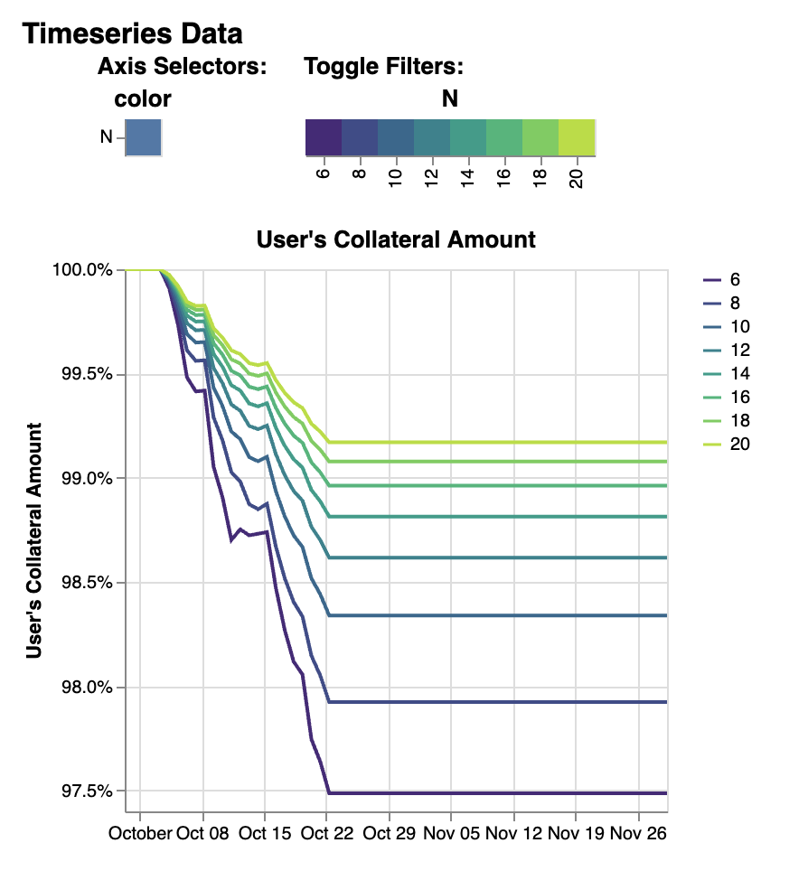

.. role:: python(code)
   :language: python

:tocdepth: 2

.. _quickstart:

Quickstart
==========

This guide will help you get up-and-running with crvUSDsim.

First, make sure that:

* crvUSDsim is :ref:`installed <install>`
* crvUSDsim is :ref:`up-to-date <updates>`

Hello world
------------

Before digging into more interesting examples, let's check the installed package can
run without issues.  In the console, run::

    $ python3 -m crvusdsim
    [INFO][11:29:54][crvusdsim.pipelines.simple]-92751: Simulating mode: rate
    [INFO][11:29:57][curvesim.price_data.sources]-92751: Fetching CoinGecko price data...
    [INFO][11:30:08][curvesim.price_data.sources]-92751: Fetching CoinGecko price data...
    [INFO][11:30:08][curvesim.price_data.sources]-92751: Fetching CoinGecko price data...
    [INFO][11:30:08][curvesim.price_data.sources]-92751: Fetching CoinGecko price data...
    [INFO][11:30:09][curvesim.price_data.sources]-92751: Fetching CoinGecko price data...
    [INFO][11:30:16][crvusdsim.templates.Strategy]-92883: [Curve.fi Stablecoin wstETH] Simulating with {'rate0': 0.15}
    [INFO][11:30:16][crvusdsim.templates.Strategy]-92880: [Curve.fi Stablecoin wstETH] Simulating with {'rate0': 0.1}
    [INFO][11:30:16][crvusdsim.templates.Strategy]-92877: [Curve.fi Stablecoin wstETH] Simulating with {'rate0': 0.05}
    Elapsed time: 28.6576099395752

Fetch a series of objects from Curve stablecoin `wstETH` market
----------------------------------------------------------------

Use collateral assets symbol, or if you know the address of the collateral asset, you can easily start
interacting with it. crvUSDsim allows you to introspect on the market's state and use its
functions without submitting actual transactions on chain.

Begin by importing the crvUSDsim module::

   >>> import crvusdsim

Let's retrieve a series of objects from Curve stablecoin `wstETH` market::

   >>> collateral_name = "wstETH" # or collateral_address "0x37417b2238aa52d0dd2d6252d989e728e8f706e4"
   >>> (pool, controller, collateral_token, stablecoin, aggregator, stableswap_pools, peg_keepers, policy, factory) 
   >>>      = crvusdsim.pool.get(market_name)

Now, we have a series of wstETH market objects:

- ``pool``: :class:`SimLLAMMAPool <crvusdsim.pool.crvusd.SimLLAMMAPool>` object
- ``controller``: :class:`SimController <crvusdsim.pool.crvusd.SimController>` object
- ``collateral_token``: :class:`ERC20 <crvusdsim.pool.crvusd.ERC20>` object
- ``stablecoin``: :class:`StableCoin <crvusdsim.pool.crvusd.StableCoin>` object
- ``aggregator``: :class:`AggregateStablePrice <crvusdsim.pool.crvusd.AggregateStablePrice>` object
- ``stableswap_pools``: List[:class:`CurveStableSwapPool <crvusdsim.pool.crvusd.CurveStableSwapPool>`]
- ``peg_keepers``: List[:class:`PegKeeper <crvusdsim.pool.crvusd.PegKeeper>`]
- ``policy``: :class:`MonetaryPolicy <crvusdsim.pool.crvusd.MonetaryPolicy>` object
- ``factory``: :class:`ControllerFactory <crvusdsim.pool.crvusd.ControllerFactory>` object

Its state is pulled from daily snapshots of the `Curve volume subgraph's crvusd module <https://github.com/curvefi/volume-subgraphs/tree/main/subgraphs/crvusd>`_.
From this object we can retrieve state information and see the result of pool 
operations such as swaps or adding liquidity.

The pool interface adheres closely to the live smart contract's, so if you are familiar
with the vyper contract, you should feel at home.

For example, to check various data about the pool::

   >>> pool.name
   'Curve.fi Stablecoin wstETH'
   
   >>> pool.coin_names
   ['wstETH', 'crvUSD']
   >>> pool.A
   100

   >>> controller.loan_discount
   90000000000000000

   >>> controller.liquidation_discount
   60000000000000000
   

Do some trade on pool, `trade` function will use `ARBITRAGUR` as trader's address, 
and mint token to `ARBITRAGUR` automatically::

   >>> dx = 10**18
   >>> pool.trade(0, 1, dx) # dx, dy, fees
   (1000000000000000000, 445225238462727, 6000000000000000)

If you want to dig into the pulled data that was used to construct the pool::

   >>> pool.metadata
   {'llamma_params': {'name': 'Curve.fi Stablecoin wstETH',
   'address': '0x37417b2238aa52d0dd2d6252d989e728e8f706e4',
   'A': '100',
   'rate': '4010591623',
   'rate_mul': '1024868101325770634',
   'fee': '0.006',
   'admin_fee': '0.000000000000000001',
   'BASE_PRICE': '2117.144587304125327462',
   'active_band': '-12',
   'min_band': '-14',
   'max_band': '1034',
   'oracle_price': '2373.921229194305616293',
   'collateral_address': '0x7f39c581f595b53c5cb19bd0b3f8da6c935e2ca0',
   'collateral_precision': '18',
   'collateral_name': 'wstETH',
   'collateral_symbol': 'wstETH',
   'bands_x': defaultdict(int,
      ...
   'addresses': ['0xf939e0a03fb07f59a73314e73794be0e57ac1b4e', '0x7f39C581F595B53c5cb19bD0b3f8dA6c935E2Ca0'],
   'decimals': [18, 18]},
   'address': '0x37417b2238aa52d0dd2d6252d989e728e8f706e4',
   'chain': 'mainnet'}

If you want to get objects with bands data or users' loan data, simply use `bands_data` parameter, 
the valid value is `pool` or `controller`::

   # get pool with `bands_x` and `bands_y` data
   >>> (pool, controller, ...) = crvusdsim.pool.get(market_name, bands_data="pool")

   >>> sum(pool.bands_x.values())
   0
   >>> sum(pool.bands_y.values())
   40106052164494685140992

   # get pool with `bands_x`, `bands_y`, `user_shares` data
   # and controller with `loan`, `loans`, `loan_ix` data
   >>> (pool, controller, ...) = crvusdsim.pool.get(market_name, bands_data="controller")

   >>> len(pool.user_shares)
   392

   >>> len(controller.loan)
   392

   >>> user0 = controller.loans[1] # user address
   >>> loan0 = controller.loan[user0] # :class:Loan
   >>> (loan0.initial_debt, loan0.initial_collateral, loan0.rate_mul, loan0.timestamp)
   (9779961749290509154648064, 6785745612366175797248, 1000000000000000000, 1700712599)

Run an arbitrage simulation for a proposed parameter
----------------------------------------------------

Rate simulations to see results of varying `rate0` parameters in `MonetaryPolicy`::

    >>> import crvusdsim
    >>> res = crvusdsim.autosim(pool="wstETH", sim_mode="rate", rate0=[0.05, 0.075, 0.10, 0.125, 0.15])

    [INFO][10:02:42][crvusdsim.pipelines.simple]-84886: Simulating mode: rate
    [INFO][10:02:50][curvesim.price_data.sources]-84886: Fetching CoinGecko price data...
    [INFO][10:03:51][curvesim.price_data.sources]-84886: Fetching CoinGecko price data...
    [INFO][10:03:52][curvesim.price_data.sources]-84886: Fetching CoinGecko price data...
    [INFO][10:05:44][curvesim.price_data.sources]-84886: Fetching CoinGecko price data...
    [INFO][10:07:22][curvesim.price_data.sources]-84886: Fetching CoinGecko price data...
    [INFO][10:07:32][crvusdsim.templates.Strategy]-84936: [Curve.fi Stablecoin wstETH] Simulating with {'rate0': 0.05}
    [INFO][10:07:32][crvusdsim.templates.Strategy]-84937: [Curve.fi Stablecoin wstETH] Simulating with {'rate0': 0.125}
    [INFO][10:07:32][crvusdsim.templates.Strategy]-84935: [Curve.fi Stablecoin wstETH] Simulating with {'rate0': 0.075}
    [INFO][10:07:32][crvusdsim.templates.Strategy]-84934: [Curve.fi Stablecoin wstETH] Simulating with {'rate0': 0.1}
    [INFO][10:07:33][crvusdsim.templates.Strategy]-84938: [Curve.fi Stablecoin wstETH] Simulating with {'rate0': 0.15}

    >>> res.summary()

    metric	annualized_rate	users_debt	crvusd_price	agg_price
    stat	mean	mean	mean	mean
    0	0.044408	1.580274e+06	1.002537	1.002775
    1	0.066533	1.583135e+06	1.002537	1.002775
    2	0.088607	1.585936e+06	1.002537	1.002775
    3	0.110631	1.588681e+06	1.002537	1.002775
    4	0.132608	1.591372e+06	1.002537	1.002775

    >>> res.data()

      run	timestamp	annualized_rate	users_debt	crvusd_price	agg_price
    0	0	2023-10-03 23:30:00+00:00	0.046259	1.574365e+06	1.001229	1.001890
    1	0	2023-10-03 23:38:34+00:00	0.046259	1.574366e+06	1.001229	1.001890
    2	0	2023-10-03 23:47:08+00:00	0.046259	1.574367e+06	1.001229	1.001890
    3	0	2023-10-03 23:55:42+00:00	0.046259	1.574368e+06	1.001229	1.001890
    4	0	2023-10-04 00:04:17+00:00	0.046259	1.574369e+06	1.001229	1.001890
    ...	...	...	...	...	...	...
    51240	4	2023-12-03 22:55:42+00:00	0.123962	1.607443e+06	1.003847	1.003959
    51241	4	2023-12-03 23:04:17+00:00	0.123962	1.607447e+06	1.003847	1.003959
    51242	4	2023-12-03 23:12:51+00:00	0.123962	1.607450e+06	1.003847	1.003959
    51243	4	2023-12-03 23:21:25+00:00	0.123962	1.607453e+06	1.003847	1.003959
    51244	4	2023-12-03 23:30:00+00:00	0.124045	1.607456e+06	1.003847	1.003946

    51245 rows x 6 columns

Tuning a pool parameter, such as the amplification coefficient ``A``.::

    >>> import crvusdsim
    >>> market_name = "wstETH"
    >>> res = crvusdsim.autosim(pool="wstETH", sim_mode="pool", A=100)
    [INFO][14:57:58][crvusdsim.pipelines.simple]-82656: Simulating mode: pool
    [INFO][14:58:00][curvesim.price_data.sources]-82656: Fetching CoinGecko price data...
    [INFO][14:58:05][crvusdsim.templates.Strategy]-82730: [Curve.fi Stablecoin wstETH] Simulating with {'A': 100}

Likely you will want to see the impact over a range of ``A`` values.  The ``A`` and ``fee`` parameters 
will accept either a integer or iterables of integers; note ``fee`` values are in units of basis points 
multiplied by 10**18.::
    
    >>> res = crvusdsim.autosim(pool="wstETH", sim_mode="pool", A=[50, 60, 80, 100], fee=[6 * 10**15, 10 * 10**15])

    [INFO][11:08:46][crvusdsim.pipelines.simple]-33804: Simulating mode: pool
    [INFO][11:09:10][curvesim.price_data.sources]-33804: Fetching CoinGecko price data...
    [INFO][11:09:44][crvusdsim.templates.Strategy]-33869: [Curve.fi Stablecoin wstETH] Simulating with {'A': 50, 'fee': 6000000000000000}
    [INFO][11:09:44][crvusdsim.templates.Strategy]-33870: [Curve.fi Stablecoin wstETH] Simulating with {'A': 50, 'fee': 10000000000000000}
    [INFO][11:09:44][crvusdsim.templates.Strategy]-33876: [Curve.fi Stablecoin wstETH] Simulating with {'A': 60, 'fee': 10000000000000000}
    [INFO][11:09:44][crvusdsim.templates.Strategy]-33875: [Curve.fi Stablecoin wstETH] Simulating with {'A': 100, 'fee': 6000000000000000}
    [INFO][11:09:44][crvusdsim.templates.Strategy]-33873: [Curve.fi Stablecoin wstETH] Simulating with {'A': 80, 'fee': 6000000000000000}
    [INFO][11:09:44][crvusdsim.templates.Strategy]-33871: [Curve.fi Stablecoin wstETH] Simulating with {'A': 60, 'fee': 6000000000000000}
    [INFO][11:09:44][crvusdsim.templates.Strategy]-33872: [Curve.fi Stablecoin wstETH] Simulating with {'A': 80, 'fee': 10000000000000000}
    [INFO][11:09:45][crvusdsim.templates.Strategy]-33874: [Curve.fi Stablecoin wstETH] Simulating with {'A': 100, 'fee': 10000000000000000}

To simlate controller's parameters, such as ``loan_discount`` and ``liquidation_discount``, use ``sim_mode="controller"``::

    >>> res = crvusdsim.autosim(pool="wstETH", sim_mode="controller",
    >>>    loan_discount=[int(0.09 * 10**18), int(0.10 * 10**18), int(0.11 * 10**18), int(0.12 * 10**18)],
    >>>    liquidation_discount=[int(0.04 * 10**18), int(0.06 * 10**18)])

    [INFO][13:50:55][crvusdsim.pipelines.simple]-7441: Simulating mode: controller
    [INFO][13:50:59][curvesim.price_data.sources]-7441: Fetching CoinGecko price data...
    [INFO][13:51:15][crvusdsim.templates.Strategy]-9436: [Curve.fi Stablecoin wstETH] Simulating with {'loan_discount': 120000000000000000, 'liquidation_discount': 60000000000000000}
    [INFO][13:51:15][crvusdsim.templates.Strategy]-9431: [Curve.fi Stablecoin wstETH] Simulating with {'loan_discount': 110000000000000000, 'liquidation_discount': 40000000000000000}
    [INFO][13:51:16][crvusdsim.templates.Strategy]-9432: [Curve.fi Stablecoin wstETH] Simulating with {'loan_discount': 100000000000000000, 'liquidation_discount': 60000000000000000}
    [INFO][13:51:16][crvusdsim.templates.Strategy]-9430: [Curve.fi Stablecoin wstETH] Simulating with {'loan_discount': 90000000000000000, 'liquidation_discount': 40000000000000000}
    [INFO][13:51:16][crvusdsim.templates.Strategy]-9433: [Curve.fi Stablecoin wstETH] Simulating with {'loan_discount': 100000000000000000, 'liquidation_discount': 40000000000000000}
    [INFO][13:51:16][crvusdsim.templates.Strategy]-9435: [Curve.fi Stablecoin wstETH] Simulating with {'loan_discount': 120000000000000000, 'liquidation_discount': 40000000000000000}
    [INFO][13:51:16][crvusdsim.templates.Strategy]-9429: [Curve.fi Stablecoin wstETH] Simulating with {'loan_discount': 90000000000000000, 'liquidation_discount': 60000000000000000}
    [INFO][13:51:16][crvusdsim.templates.Strategy]-9434: [Curve.fi Stablecoin wstETH] Simulating with {'loan_discount': 110000000000000000, 'liquidation_discount': 60000000000000000}

    >>> res.summary()

    metric	averange_user_health	liquidations_count	liquidation_volume
    stat	mean	max	sum
    0	0.010677	20.0	1.246573e+11
    1	0.004959	20.0	1.409887e+11
    2	0.014525	20.0	1.156440e+11
    3	0.007697	20.0	1.310613e+11
    4	0.019034	20.0	1.059855e+11
    5	0.011063	20.0	1.206467e+11
    6	0.024296	20.0	9.143412e+10
    7	0.015066	20.0	1.116965e+11

    >>> res.summary(full=True)

    	loan_discount	liquidation_discount	averange_user_health mean	liquidations_count max	liquidation_volume sum
    0	0.09	0.04	0.010677	20.0	1.246573e+11
    1	0.09	0.06	0.004959	20.0	1.409887e+11
    2	0.10	0.04	0.014525	20.0	1.156440e+11
    3	0.10	0.06	0.007697	20.0	1.310613e+11
    4	0.11	0.04	0.019034	20.0	1.059855e+11
    5	0.11	0.06	0.011063	20.0	1.206467e+11
    6	0.12	0.04	0.024296	20.0	9.143412e+10
    7	0.12	0.06	0.015066	20.0	1.116965e+11

    >>> res.data()

        run	timestamp	averange_user_health	liquidations_count	liquidation_volume
    0	0	2023-09-18 23:30:00+00:00	0.036745	0.0	0.0
    1	0	2023-09-18 23:38:34+00:00	0.036745	0.0	0.0
    2	0	2023-09-18 23:47:08+00:00	0.036743	0.0	0.0
    3	0	2023-09-18 23:55:42+00:00	0.036739	0.0	0.0
    4	0	2023-09-19 00:04:17+00:00	0.036733	0.0	0.0
    ...	...	...	...	...	...
    40991	3	2023-11-18 22:55:42+00:00	0.045240	0.0	0.0
    40992	3	2023-11-18 23:04:17+00:00	0.045240	0.0	0.0
    40993	3	2023-11-18 23:12:51+00:00	0.045240	0.0	0.0
    40994	3	2023-11-18 23:21:25+00:00	0.045240	0.0	0.0
    40995	3	2023-11-18 23:30:00+00:00	0.045240	0.0	0.0

    40996 rows x 5 columns

    >>> res.data(full=True)

    	loan_discount	liquidation_discount	run	timestamp	averange_user_health	liquidations_count	liquidation_volume
    0	0.09	0.04	0	2023-09-27 23:30:00+00:00	0.065833	0.0	0.000000e+00
    1	0.09	0.04	0	2023-09-27 23:38:34+00:00	0.065813	0.0	0.000000e+00
    2	0.09	0.04	0	2023-09-27 23:47:08+00:00	0.065794	0.0	0.000000e+00
    3	0.09	0.04	0	2023-09-27 23:55:42+00:00	0.065774	0.0	0.000000e+00
    4	0.09	0.04	0	2023-09-28 00:04:17+00:00	0.065755	0.0	0.000000e+00
    ...	...	...	...	...	...	...	...
    81987	0.12	0.06	7	2023-11-27 22:55:42+00:00	-0.000019	20.0	1.779585e+07
    81988	0.12	0.06	7	2023-11-27 23:04:17+00:00	-0.000019	20.0	1.779585e+07
    81989	0.12	0.06	7	2023-11-27 23:12:51+00:00	-0.000019	20.0	1.779585e+07
    81990	0.12	0.06	7	2023-11-27 23:21:25+00:00	-0.000019	20.0	1.779585e+07
    81991	0.12	0.06	7	2023-11-27 23:30:00+00:00	-0.000019	20.0	1.779585e+07
    
    81992 rows x 7 columns

To simlate ``create_loan`` with different ``N`` parameters, use ``sim_mode="N"``::

    >>> res = crvusdsim.autosim(pool="wstETH", sim_mode="N", N=[4, 6, 8, 10, 20, 40, 50])

    [INFO][17:17:50][crvusdsim.pipelines.simple]-91016: Simulating mode: N
    [INFO][17:17:53][curvesim.price_data.sources]-91016: Fetching CoinGecko price data...
    [INFO][17:17:59][crvusdsim.templates.Strategy]-91351: [Curve.fi Stablecoin wstETH] Simulating with {'N': 8}
    [INFO][17:18:01][crvusdsim.templates.Strategy]-91354: [Curve.fi Stablecoin wstETH] Simulating with {'N': 40}
    [INFO][17:18:01][crvusdsim.templates.Strategy]-91349: [Curve.fi Stablecoin wstETH] Simulating with {'N': 4}
    [INFO][17:18:01][crvusdsim.templates.Strategy]-91355: [Curve.fi Stablecoin wstETH] Simulating with {'N': 50}
    [INFO][17:18:01][crvusdsim.templates.Strategy]-91352: [Curve.fi Stablecoin wstETH] Simulating with {'N': 10}
    [INFO][17:18:01][crvusdsim.templates.Strategy]-91353: [Curve.fi Stablecoin wstETH] Simulating with {'N': 20}
    [INFO][17:18:01][crvusdsim.templates.Strategy]-91350: [Curve.fi Stablecoin wstETH] Simulating with {'N': 6}

    >>> res.summary()

    metric	user_value
    stat	annualized_returns
    0	-0.228595
    1	-0.168579
    2	-0.129110
    3	-0.104466
    4	-0.053433
    5	-0.027022
    6	-0.021667

    >>> res.data()

        run	timestamp	user_value
    0	0	2023-09-18 23:30:00+00:00	1.000000
    1	0	2023-09-18 23:38:34+00:00	1.000000
    2	0	2023-09-18 23:47:08+00:00	1.000000
    3	0	2023-09-18 23:55:42+00:00	1.000000
    4	0	2023-09-19 00:04:17+00:00	1.000000
    ...	...	...	...
    71738	6	2023-11-18 22:55:42+00:00	0.996344
    71739	6	2023-11-18 23:04:17+00:00	0.996344
    71740	6	2023-11-18 23:12:51+00:00	0.996344
    71741	6	2023-11-18 23:21:25+00:00	0.996344
    71742	6	2023-11-18 23:30:00+00:00	0.996344
    71743 rows x 3 columns

Results
-------

The simulation returns a SimResults object (here, ``res``) that can plot simulation metrics or return them as DataFrames.

Plotting
^^^^^^^^

The ``plot()`` method is used to generate and/or save plots::

    #Plot results using Altair
    >>> res.plot() 

    #Save plot results as results_pool.html
    >>> res.plot(save_as="results_pool.html")

Screenshots of resulting plots (truncated):
^^^^^^^^^^^^^^^^^^^^^^^^^^^^^^^^^^^^^^^^^^^

``sim_mode="rate"``

.. image:: images/rate_plot_timeseries_screenshot.png
  :width: 700
  :alt: Timeseries data

``sim_mode="pool"``

.. image:: images/pool_plot_summary_screenshot.png
  :width: 700
  :alt: Summary statistics

``sim_mode="controller"``

.. image:: images/controller_plot_summary_screenshot.png
  :width: 700
  :alt: Summary statistics

.. image:: images/controller_plot_timeseries_screenshot.png
  :width: 700
  :alt: Timeseries data

``sim_mode="N"``

.. image:: images/N_plot_summary_screenshot.png
  :width: 350
  :alt: Summary statistics

Metrics
^^^^^^^

The ``summary`` method returns metrics summarizing each simulation run::

    >>> res.summary()
    metric	pool_value	arb_profits_percent	pool_volume	arb_profit	pool_fees
    stat	annualized_returns	annualized_arb_profits	sum	sum	sum
    0	0.738073	-0.028339	4.828494e+09	8.927715e+06	6.569253e+07
    1	0.710731	-0.024171	3.570275e+09	7.637157e+06	8.394951e+07
    2	0.750342	-0.028429	4.862393e+09	9.030913e+06	6.623314e+07
    3	0.739814	-0.021498	3.466717e+09	6.850344e+06	8.196935e+07
    4	0.742118	-0.029061	4.860781e+09	9.280159e+06	6.617865e+07
    5	0.727234	-0.023468	3.487223e+09	7.472891e+06	8.250836e+07
    6	0.734865	-0.029247	4.905499e+09	9.297305e+06	6.660625e+07
    7	0.731708	-0.021982	3.404420e+09	7.003415e+06	8.079451e+07

To include the parameters used in each run, use the ``full`` argument::

    >>> res.summary(full=True)
    	A	Fee	pool_value annualized_returns	arb_profits_percent annualized_arb_profits	pool_volume sum	arb_profit sum	pool_fees sum
    0	50	0.006	0.738073	-0.028339	4.828494e+09	8.927715e+06	6.569253e+07
    1	50	0.010	0.710731	-0.024171	3.570275e+09	7.637157e+06	8.394951e+07
    2	60	0.006	0.750342	-0.028429	4.862393e+09	9.030913e+06	6.623314e+07
    3	60	0.010	0.739814	-0.021498	3.466717e+09	6.850344e+06	8.196935e+07
    4	80	0.006	0.742118	-0.029061	4.860781e+09	9.280159e+06	6.617865e+07
    5	80	0.010	0.727234	-0.023468	3.487223e+09	7.472891e+06	8.250836e+07
    6	100	0.006	0.734865	-0.029247	4.905499e+09	9.297305e+06	6.660625e+07
    7	100	0.010	0.731708	-0.021982	3.404420e+09	7.003415e+06	8.079451e+07

The ``data`` method returns metrics recorded at each timestamp of each run::

    >>> res.data()
     	run	timestamp	pool_value	arb_profits_percent	pool_volume	arb_profit	pool_fees
    0	0	2023-09-26 23:30:00+00:00	1.783265e+09	0.000000	0.0	0.0	0.0
    1	0	2023-09-26 23:38:34+00:00	1.783349e+09	0.000000	0.0	0.0	0.0
    2	0	2023-09-26 23:47:08+00:00	1.783433e+09	0.000000	0.0	0.0	0.0
    3	0	2023-09-26 23:55:42+00:00	1.783518e+09	0.000000	0.0	0.0	0.0
    4	0	2023-09-27 00:04:17+00:00	1.783602e+09	0.000000	0.0	0.0	0.0
    ...	...	...	...	...	...	...	...
    81987	7	2023-11-26 22:55:42+00:00	1.970115e+09	-0.003708	0.0	0.0	0.0
    81988	7	2023-11-26 23:04:17+00:00	1.970115e+09	-0.003708	0.0	0.0	0.0
    81989	7	2023-11-26 23:12:51+00:00	1.970115e+09	-0.003708	0.0	0.0	0.0
    81990	7	2023-11-26 23:21:25+00:00	1.970115e+09	-0.003708	0.0	0.0	0.0
    81991	7	2023-11-26 23:30:00+00:00	1.970115e+09	-0.003708	0.0	0.0	0.0

    [81992 rows × 7 columns]

The data method also accepts the ``full`` argument. However, the output may be prohibitively large::

    >>> res.data(full=True)
    	A	Fee	run	timestamp	pool_value	arb_profits_percent	pool_volume	arb_profit	pool_fees
    0	50	0.006	0	2023-09-26 23:30:00+00:00	1.783265e+09	0.000000	0.0	0.0	0.0
    1	50	0.006	0	2023-09-26 23:38:34+00:00	1.783349e+09	0.000000	0.0	0.0	0.0
    2	50	0.006	0	2023-09-26 23:47:08+00:00	1.783433e+09	0.000000	0.0	0.0	0.0
    3	50	0.006	0	2023-09-26 23:55:42+00:00	1.783518e+09	0.000000	0.0	0.0	0.0
    4	50	0.006	0	2023-09-27 00:04:17+00:00	1.783602e+09	0.000000	0.0	0.0	0.0
    ...	...	...	...	...	...	...	...	...	...
    81987	100	0.010	7	2023-11-26 22:55:42+00:00	1.970115e+09	-0.003708	0.0	0.0	0.0
    81988	100	0.010	7	2023-11-26 23:04:17+00:00	1.970115e+09	-0.003708	0.0	0.0	0.0
    81989	100	0.010	7	2023-11-26 23:12:51+00:00	1.970115e+09	-0.003708	0.0	0.0	0.0
    81990	100	0.010	7	2023-11-26 23:21:25+00:00	1.970115e+09	-0.003708	0.0	0.0	0.0
    81991	100	0.010	7	2023-11-26 23:30:00+00:00	1.970115e+09	-0.003708	0.0	0.0	0.0

    [81992 rows x 9 columns]

Fine-tuning the simulator
-------------------------
Other helpful parameters for :func:`.autosim` are:

    - ``src``: data source for prices and volumes.  Allowed values are:

      - **"coingecko"**: CoinGecko API (free); default
      - **"local"**: local data stored in the "data" folder

    - ``ncpu``: Number of cores to use.
    - ``days``: Number of days to fetch data for.
    - ``end_ts``: End timestamp in Unix time.
    - ``bands_strategy_class``: Strategy used to initialize liquidity in LLAMMA pool bands

      - 1: :class:`class::crvusdsim.pool_data.metadata.BandsStrategy`
      - 2: valid input: :class:`SimpleUsersBandsStrategy`, :class:`IinitYBandsStrategy`, :class:`UserLoansBandsStrategy`,
      - 3: or a custom strategy that inherits :class:`class::crvusdsim.pool_data.metadata.BandsStrategy`

    - ``prices_max_interval``: The maximum interval for pricing data. If the time interval between two 
        adjacent data exceeds this value, interpolation processing will be performed automatically.
    - ``profit_threshold``: Profit threshold for arbitrageurs, trades with profits below this value will not be executed

Tips
----

Pricing data
^^^^^^^^^^^^^

By default, crvUSDsim follows the pricing data module of curvesim, uses Coingecko pricing and volume data.
To replace the no longer available Nomics service, we expect to onboard another data provider and
also provide an option to load data files.

Note on CoinGecko Data
"""""""""""""""""""""""
Coingecko price/volume data is computed using all trading pairs for each coin, with volume summed across all pairs. 
Therefore, market volume taken from CoinGecko can be much higher than that of any specific trading pair used in a simulation. 
This issue is largely ameloriated by our volume limiting approach, with CoinGecko results typically mirroring results from 
pairwise data, but it should be noted that CoinGecko data may be less reliable than more granular data for certain simulations.

Parallel processing
^^^^^^^^^^^^^^^^^^^
By default, crvUSDsim will use the maximum number of cores available to run
simulations.  You can specify the exact number through the ``ncpu`` option.

For profiling the code, it is recommended to use ``ncpu=1``, as common
profilers (such as ``cProfile``) will not produce accurate results otherwise.

Errors and Exceptions
---------------------

All exceptions that crvUSDsim explicitly raises inherit from
:exc:`curvesim.exceptions.curvesimException`.

-----------------------

.. Ready for more? Check out the :ref:`advanced <advanced>` section.

